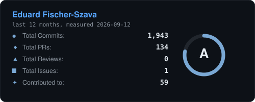

## The stack

<!-- STACK:START -->

<strong>Backend</strong> &nbsp;&nbsp;&nbsp;&nbsp;&nbsp;&nbsp;&nbsp;&nbsp;&nbsp;&nbsp;&nbsp; &nbsp;&nbsp;&nbsp;&nbsp;&nbsp;&nbsp;&nbsp;&nbsp;&nbsp;&nbsp;&nbsp;  
<strong>Frontend</strong> &nbsp;&nbsp;&nbsp;&nbsp;&nbsp;&nbsp; &nbsp;&nbsp;&nbsp;&nbsp;&nbsp;  
<strong>Mobile</strong> &nbsp;&nbsp;  
<strong>Data</strong> &nbsp;&nbsp;&nbsp;&nbsp;&nbsp;&nbsp;&nbsp;&nbsp;&nbsp;&nbsp;  
<strong>Quality</strong> &nbsp;&nbsp;&nbsp;&nbsp;&nbsp;&nbsp; &nbsp;&nbsp;&nbsp;&nbsp;&nbsp;&nbsp;  
<strong>Operations</strong> &nbsp;&nbsp;&nbsp;&nbsp;&nbsp;&nbsp;&nbsp;&nbsp;&nbsp;&nbsp;&nbsp; &nbsp;&nbsp;&nbsp;&nbsp;&nbsp;&nbsp;&nbsp;&nbsp;&nbsp;&nbsp;

<!-- STACK:END -->

## Open source

**45 merged pull requests across 32 upstream projects**, among them
[angular](https://github.com/angular/angular), [eslint](https://github.com/eslint/eslint),
[jest](https://github.com/jestjs/jest), [vite](https://github.com/vitejs/vite),
[dotnet/aspnetcore](https://github.com/dotnet/aspnetcore) and
[fastify](https://github.com/fastify/fastify).

I track merged rather than stars. Stars measure whether people liked the idea; merged measures
whether a maintainer who owns the consequences agreed to carry it.

## Elsewhere

[Case studies and writing](https://eduardfischer.dev) &middot;
[LinkedIn](https://www.linkedin.com/in/eduard-fischer-szava/) &middot;
fischer_eduard@yahoo.com

Cards are generated by <a href="./grade-card.mjs">grade-card.mjs</a> and
<a href="./lang-card.mjs">lang-card.mjs</a> from the GitHub API and committed as files, each stamped
with the day it was measured. The grade formula is printed in the generator rather than hidden, and
the language card counts only my own repositories, public and private, with forks and vendored trees
excluded. Most of my C# lives in employer repositories, which is why it is quiet here and loud
everywhere else.
