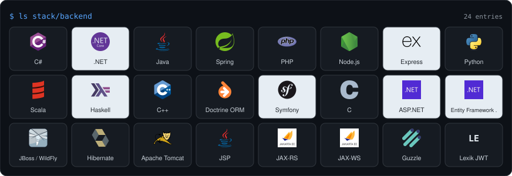
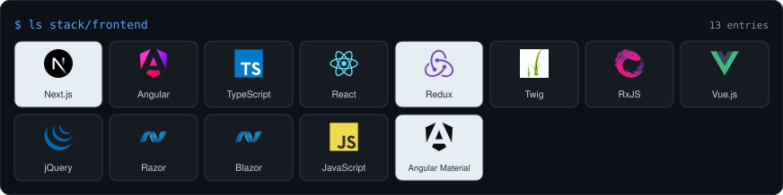
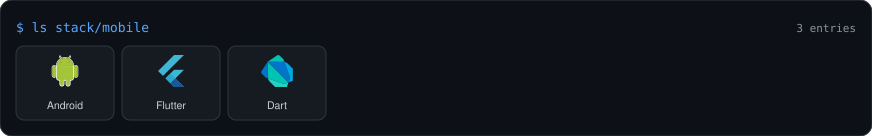
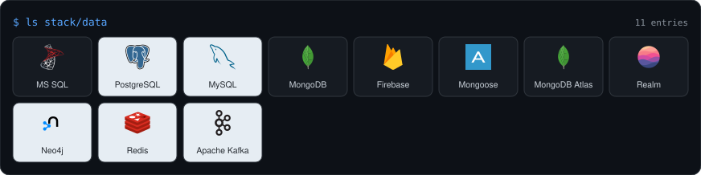
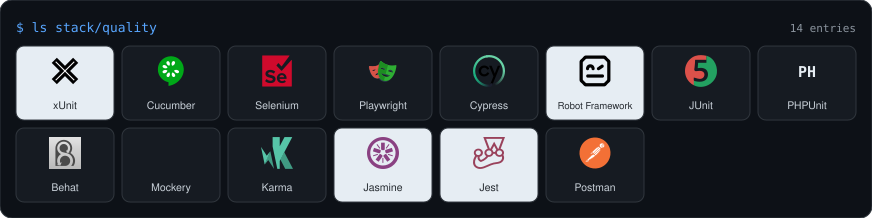
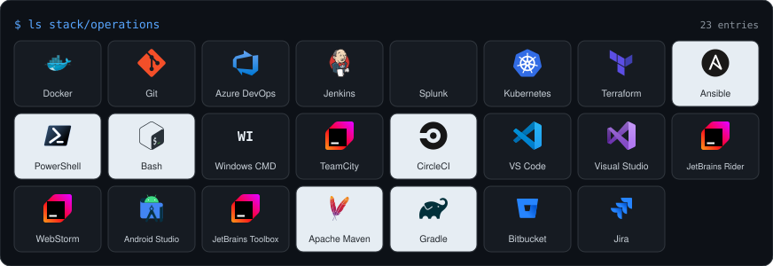

```text
  _____    _                     _
 | ____|__| |_   _  __ _ _ __ __| |
 |  _| / _` | | | |/ _` | '__/ _` |
 | |__| (_| | |_| | (_| | | | (_| |
 |_____\__,_|\__,_|\__,_|_|  \__,_|

 $ whoami
 Eduard Fischer-Szava, Aarhus, Denmark
 full-stack and platform engineer, C#/.NET and TypeScript

 $ cat languages.txt
 Romanian (mother tongue), Danish and English (fluent)

 $ uptime
 nine years in Denmark, five of them shipping software for Danish companies:
 a national election platform, an energy company's customer self-service
 platform, a renewable-energy SaaS, and a mission-critical defence suite
```

## $ cat now.txt

- **Working:** frontend engineer and consultant at Mjølner Informatics, Aarhus, on Mit Norlys, the customer self-service platform of Norlys.
  - React 19 and TypeScript in an Nx monorepo; .NET 9 backend-for-frontend on an event-sourced CQRS stack (Marten, Wolverine).
  - The team's Playwright CI foundation; two live Datadog dashboards.
- **Open source:** 45 merged pull requests across 32 upstream projects, among them [angular](https://github.com/angular/angular), [eslint](https://github.com/eslint/eslint), [jest](https://github.com/jestjs/jest), [vite](https://github.com/vitejs/vite), [freeCodeCamp](https://github.com/freeCodeCamp/freeCodeCamp), [dotnet/aspnetcore](https://github.com/dotnet/aspnetcore), [dotnet/sdk](https://github.com/dotnet/sdk), [fastify](https://github.com/fastify/fastify), [hono](https://github.com/honojs/hono), [react-hook-form](https://github.com/react-hook-form/react-hook-form) and [MudBlazor](https://github.com/MudBlazor/MudBlazor). The forks on this profile are the evidence trail. I track the merged count rather than stars, because merged upstream work is the number somebody else signed off on.
- **At home:** a one-GPU AI estate: a task bus where cloud models cross-review each other's work, mechanical quality gates, a local model fleet, two phones serving as small reviewers, and a control surface I built to watch all of it.

## $ git stats

<p align="center">
  
</p>
<p align="center">
  
</p>

Both cards are static SVGs generated from the GitHub API by [`stats-card.mjs`](./stats-card.mjs) and [`lang-card.mjs`](./lang-card.mjs), each stamped with the day it was measured. Static on purpose: the hosted stats services 503 under load and the image then breaks on the page, and a file in the repository cannot. The languages card counts my own repositories, public and private, with forks and vendored third-party trees excluded, so upstream projects I contributed to and libraries I checked in do not count as my code. Most of my C# lives in employer repositories, which is why it is missing there and present everywhere else on this page.

## $ ls stack/

The same six categories, the same 88 entries and the same order as the skills section of [eduardfischer.dev](https://eduardfischer.dev); the cards are generated from that site's source of truth (`src/lib/tech.ts`) so the two never drift apart.

<p align="center"></p>
<p align="center"></p>
<p align="center"></p>
<p align="center"></p>
<p align="center"></p>
<p align="center"></p>

<details>
<summary>The same list as text</summary>

```text
backend     C#  .NET  Java  Spring  PHP  Node.js  Express  Python  Scala  Haskell  C++
            Doctrine ORM  Symfony  C  ASP.NET  Entity Framework Core  JBoss / WildFly
            Hibernate  Apache Tomcat  JSP  JAX-RS  JAX-WS  Guzzle  Lexik JWT
frontend    Next.js  Angular  TypeScript  React  Redux  Twig  RxJS  Vue.js  jQuery
            Razor  Blazor  JavaScript  Angular Material
mobile      Android  Flutter  Dart
data        MS SQL  PostgreSQL  MySQL  MongoDB  Firebase  Mongoose  MongoDB Atlas
            Realm  Neo4j  Redis  Apache Kafka
quality     xUnit  Cucumber  Selenium  Playwright  Cypress  Robot Framework  JUnit
            PHPUnit  Behat  Mockery  Karma  Jasmine  Jest  Postman
operations  Docker  Git  Azure DevOps  Jenkins  Splunk  Kubernetes  Terraform  Ansible
            PowerShell  Bash  Windows CMD  TeamCity  CircleCI  VS Code  Visual Studio
            JetBrains Rider  WebStorm  Android Studio  JetBrains Toolbox  Apache Maven
            Gradle  Bitbucket  Jira
ai          Claude Code, OpenAI Codex, Google Antigravity, DeepSeek, OpenRouter, Ollama
```

</details>

## $ cat work-history.md

| When | Where | What |
| --- | --- | --- |
| 2026 | Mjølner Informatics, Aarhus | Mit Norlys, see the now.txt block above |
| 2024 to 2026 | Netcompany, Aarhus | IT consultant on KOMBIT VALG, Denmark's administrative election platform: C#/.NET and Angular, plus a UI component catalog for STIL's UA.dk |
| 2021 to 2024 | Greenbyte, Horsens | Software engineer on Kalenda, a renewable-energy SaaS: .NET Core, EF Core and React, architect of the Flutter mobile app |
| 2021 to 2022 | Boozt Fashion, Malmö | System engineer on the boozt.com backend in PHP/Symfony |
| 2021 | Systematic, Aarhus | Junior systems engineer on the SitaWare suite: Java and Angular |

MSc in Technology-Based Business Development, Aarhus University. BSc in Software Technology Engineering, VIA University College.

## $ cat estate.txt

One RTX 5090, not a demo. Operations in PowerShell; services and MCP servers in TypeScript and Python.

```text
                          operator
                             |
                   +---------v---------+
                   |   A2A task bus    |   every task carries a spec,
                   |   claim / verdict |   a verifier and a paper trail
                   +----+---------+----+
                        |         |
         +--------------v--+   +--v----------------------+
         | local fleet     |   | cloud reviewers         |
         | RTX 5090, Ollama|   | DeepSeek, Kimi, GLM     |
         | llama.cpp, two  |   | a verdict needs 3 of 3  |
         | phones          |   |                         |
         +--------+--------+   +-----------+-------------+
                  |                        |
    +-------------v------------------------v--------------+
    |  quality gates: review gate, audit gate, boundary   |
    |  gate, test coverage measured by execution trace    |
    +-------+------------------+------------------+-------+
            |                  |                  |
   +--------v-------+  +-------v--------+  +------v---------+
   | knowledge vault|  | OmniControl    |  | observability  |
   | Postgres,      |  | shell + BFF,   |  | Prometheus,    |
   | pgvector, MCP  |  | 20 modules     |  | Grafana, OTel  |
   +----------------+  +----------------+  +----------------+
```

## $ cat how-i-work.md

Measured work over vibes. Every change I ship carries a test record, and a claim of done is peer-reviewed before it counts. A post-mortem that only looks at the losses gets a paired win/loss count before it is allowed to become a rule, because a feature every failure shares is usually one the successes share too.

## $ cat contact.txt

- [LinkedIn](https://www.linkedin.com/in/eduard-fischer-szava/)
- [Case studies](https://eduardfischer.dev)
- fischer_eduard@yahoo.com
- Based in Aarhus, open to Jutland-wide roles.
