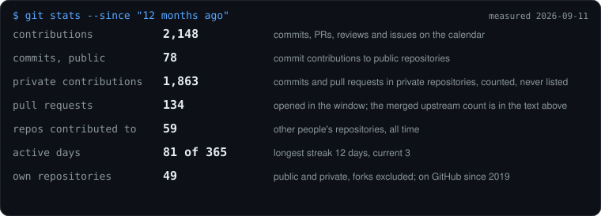
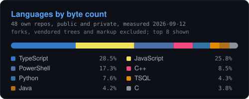

```text
  _____    _                     _
 | ____|__| |_   _  __ _ _ __ __| |
 |  _| / _` | | | |/ _` | '__/ _` |
 | |__| (_| | |_| | (_| | | | (_| |
 |_____\__,_|\__,_|\__,_|_|  \__,_|

 $ whoami
 Eduard Fischer-Szava, Aarhus, Denmark
 full-stack and platform engineer, C#/.NET and TypeScript
 Romanian (mother tongue), Danish and English (fluent)
```

Nine years in Denmark, five of them shipping software for Danish companies: a national
election platform, an energy company's customer self-service platform, a renewable-energy
SaaS and a mission-critical defence suite.

**Now** frontend engineer and consultant at Mjølner Informatics, on Mit Norlys, the customer
self-service platform of Norlys. React 19 and TypeScript in an Nx monorepo, a .NET 9
backend-for-frontend on an event-sourced CQRS stack, and the team's Playwright CI foundation.

**Open source** 45 merged pull requests across 32 upstream projects, among them
[angular](https://github.com/angular/angular), [eslint](https://github.com/eslint/eslint),
[jest](https://github.com/jestjs/jest), [vite](https://github.com/vitejs/vite),
[dotnet/aspnetcore](https://github.com/dotnet/aspnetcore) and
[fastify](https://github.com/fastify/fastify). I track merged, not stars: it is the number
somebody else signed off on.

**At home** a one-GPU AI estate. A task bus where cloud models cross-review each other's
work, mechanical quality gates, a local model fleet, and a control surface to watch it.

<p align="center">
  
</p>

### Work

| When | Where | What |
| --- | --- | --- |
| 2026 | Mjølner Informatics, Aarhus | Mit Norlys, above |
| 2024 to 2026 | Netcompany, Aarhus | KOMBIT VALG, Denmark's administrative election platform: C#/.NET and Angular |
| 2021 to 2024 | Greenbyte, Horsens | Kalenda, a renewable-energy SaaS: .NET Core, EF Core, React; architect of the Flutter app |
| 2021 to 2022 | Boozt Fashion, Malmö | boozt.com backend in PHP/Symfony |
| 2021 | Systematic, Aarhus | SitaWare defence suite: Java and Angular |

MSc in Technology-Based Business Development, Aarhus University.
BSc in Software Technology Engineering, VIA University College.

[LinkedIn](https://www.linkedin.com/in/eduard-fischer-szava/) &middot;
[Case studies](https://eduardfischer.dev) &middot;
fischer_eduard@yahoo.com &middot; Aarhus, open to Jutland-wide roles

<details>
<summary>The full stack, and the languages card</summary>

<p align="center">
  
</p>

Most of my C# lives in employer repositories, which is why it is missing here and present
everywhere else on this page. Both cards are static SVGs generated from the GitHub API by
[`stats-card.mjs`](./stats-card.mjs) and [`lang-card.mjs`](./lang-card.mjs), each stamped with
the day it was measured. Static on purpose: the hosted stats services 503 under load and the
image then breaks on the page.

The same six categories and the same order as the skills section of
[eduardfischer.dev](https://eduardfischer.dev), generated from that site's `src/lib/tech.ts`
so the two never drift apart.

```text
backend     C#  .NET  Java  Spring  PHP  Node.js  Express  Python  Scala  Haskell  C++
            Doctrine ORM  Symfony  C  ASP.NET  Entity Framework Core  JBoss / WildFly
            Hibernate  Apache Tomcat  JSP  JAX-RS  JAX-WS  Guzzle  Lexik JWT
frontend    Next.js  Angular  TypeScript  React  Redux  Twig  RxJS  Vue.js  jQuery
            Razor  Blazor  JavaScript  Angular Material
mobile      Android  Flutter  Dart
data        MS SQL  PostgreSQL  MySQL  MongoDB  Firebase  Mongoose  MongoDB Atlas
            Realm  Neo4j  Redis  Apache Kafka
quality     xUnit  Cucumber  Selenium  Playwright  Cypress  Robot Framework  JUnit
            PHPUnit  Behat  Mockery  Karma  Jasmine  Jest  Postman
operations  Docker  Git  Azure DevOps  Jenkins  Splunk  Kubernetes  Terraform  Ansible
            PowerShell  Bash  Windows CMD  TeamCity  CircleCI  VS Code  Visual Studio
            JetBrains Rider  WebStorm  Android Studio  JetBrains Toolbox  Apache Maven
            Gradle  Bitbucket  Jira
ai          Claude Code, OpenAI Codex, Google Antigravity, DeepSeek, OpenRouter, Ollama
```

</details>

<details>
<summary>How the estate is wired, and how I work</summary>

One RTX 5090, not a demo. Operations in PowerShell; services and MCP servers in TypeScript
and Python.

```text
                          operator
                             |
                   +---------v---------+
                   |   A2A task bus    |   every task carries a spec,
                   |   claim / verdict |   a verifier and a paper trail
                   +----+---------+----+
                        |         |
         +--------------v--+   +--v----------------------+
         | local fleet     |   | cloud reviewers         |
         | RTX 5090, Ollama|   | DeepSeek, Kimi, GLM     |
         | llama.cpp, two  |   | a verdict needs 3 of 3  |
         | phones          |   |                         |
         +--------+--------+   +-----------+-------------+
                  |                        |
    +-------------v------------------------v--------------+
    |  quality gates: review gate, audit gate, boundary   |
    |  gate, test coverage measured by execution trace    |
    +-------+------------------+------------------+-------+
            |                  |                  |
   +--------v-------+  +-------v--------+  +------v---------+
   | knowledge vault|  | OmniControl    |  | observability  |
   | Postgres,      |  | shell + BFF,   |  | Prometheus,    |
   | pgvector, MCP  |  | 20 modules     |  | Grafana, OTel  |
   +----------------+  +----------------+  +----------------+
```

Measured work over vibes. Every change I ship carries a test record, and a claim of done is
peer-reviewed before it counts. A post-mortem that only looks at the losses gets a paired
win/loss count before it is allowed to become a rule, because a feature every failure shares
is usually one the successes share too.

</details>
